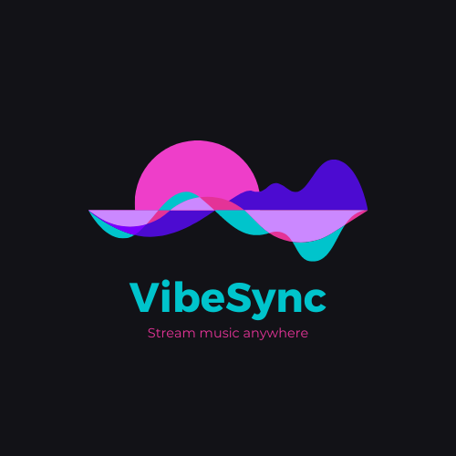
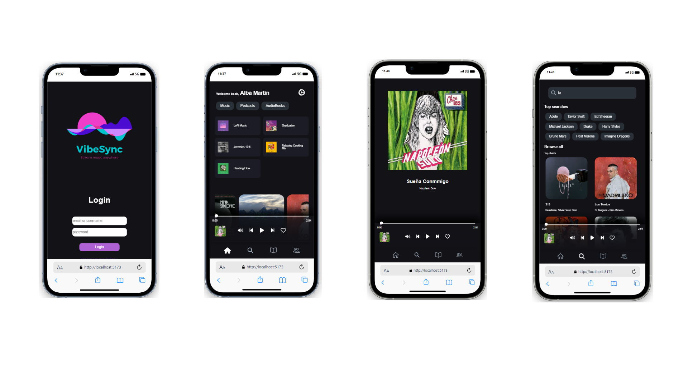
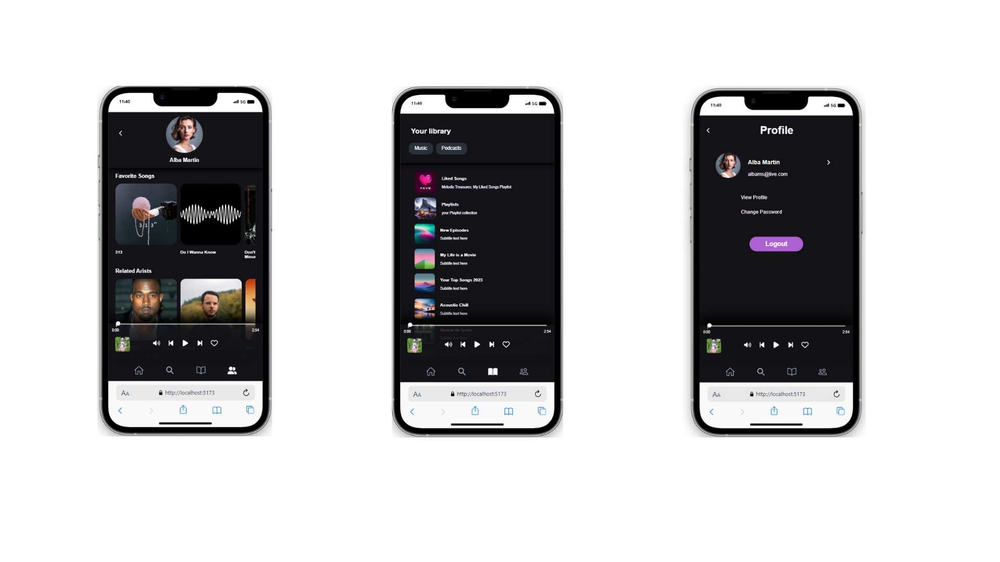

# 📲 VibeSync

VibeSync is an application that allows you to discover and enjoy music while interacting with your favorite songs and artists.

## 🎧 Features

- Explore a wide variety of music across different genres.
- Like your favorite songs to save and easily access them later.
- Intuitive and user-friendly interface designed for mobile devices and tablets.
- Developed using modern technologies such as React, Vite, JSON Server and TypeScript.
- Utilizes React Skeleton for fast UI loading.
- Incorporates React Hot Toast for instant and appealing notifications.
- Multiple Pages:
    - Login Page: Allows registered users to log in.
    - Signup Page: Allows new users to register.
    - Home Page: Displays the entire music catalog.
    - Search Page: Enables users to search and filter by artist, song, album, or playlist.
    - User Page: Provides access to the user's saved music and the ability to change settings or logout.

## ⚙️ Tech Stack

- React: Front-end JavaScript library for building user interfaces.

- React Router: Library for handling navigation and routing in React applications.

- React-hot-toast: A lightweight and customizable toast notification library for React applications.

- React Skeleton: a helpful technique for optimizing user experience in web applications, especially those that rely heavily on dynamic content or asynchronous data fetching.

- JSON server: a simple and lightweight server that allows you to quickly create a RESTful API using a JSON file as a data source.

## 📷 Screenshots

## Daily Log

    
## Struggles